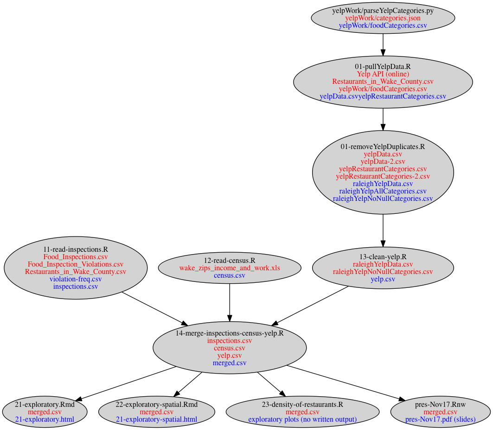
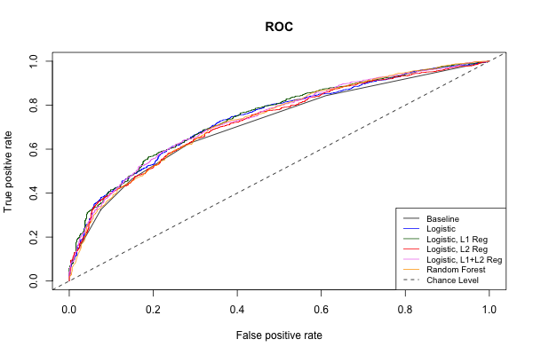

Memo for Raleigh Work
==============================================

Author: Alex Perrone.

Updated: 01/02/17. 

## Code 

All code has been committed to `restaurant_inspections/raleigh/code`. 
The file `merged.csv` represents all the cleaned and merged 
data from inspections/violations, Wake county restaurant information, Census data, 
and Yelp data. The file `pres-Nov17.Rnw` was used to generate the slides `pres-Nov17.pdf` 
which were presented to GovEx on 17 November 2016. 

## Dataset

The workflow for Raleigh is as follows. Each node represents a script (such as an R or Python script)
where red indicates the input files and blue indicates output files. 
Unless mentioned otherwise, code is in `raleigh/code` and data are in `raleigh/data`. 

The image can be found in `restaurant_inspections/raleigh/doc/workflow.png`, 
which was generated by its corresponding `workflow.dot`.

### Inspections/Violations

Relevant file: `11-read-inspections.R`. 

The inspections (`Food_Inspections.csv`) and violations (`Food_Inspection_Violations.csv`)
were in two separate files with a common key `HSISID`. 
Since these files included no restaurant information such as name, address, zip, facility type, etc., 
the file `Restaurants_in_Wake_County.csv` was used to provide this information; 
this file also had the key `HSISID`. 

The violations were in the format of one violation per row, thus a given inspection may 
span multiple rows. 
The violations were aggregated to counts of critical and non-critical violations per inspection. 

The data sources (inspections, violations, restaurant info) were inner-joined by `HSISID`
such that any records that did not match across all three data sources were excluded. 
In particular, the inspections and violations datasets were joined by `HSISID` and `Date` 
so that the inspections and violations matched in time, then this joined dataset 
was matched with the restaurant information by `HSISID`. 

|Dataset|Number of Rows|Number of Unique HSISID|
|---|---|---|
|Inspections|23860|4569|
|Violations|22968|4270|
|Restaurant Information|3324|3324|
|Merged Inspections|18704|3045|

Only 323 out of the 23860 inspections (1.4%) were given as type "re-inspection" in the 
data, so no distinction was made for re-inspections in the analysis. 

Each inspection resulted in a Score, but number of critical violations were 
instead used as a target (response) variable. 

There were numerous categories of facility types, as shown in table below. 
All types were included, though many of these types were excluded in modeling
because they did not match with Yelp data. 

|FacilityType               |     N|
|:--------------------------|-----:|
|Restaurant                 | 12086|
|Food Stand                 |  3199|
|Public School Lunchrooms   |  1587|
|Meat Market                |   732|
|Institutional Food Service |   352|
|Mobile Food Units          |   195|
|Private School Lunchrooms  |   135|
|Pushcarts                  |   111|
|Elderly Sites              |    69|
|Limited Food Service       |     3|

### Census

Relevant files: `12-read-census.R`, `14-merge-inspections-census-yelp.R`. 

There were six census data sources, each at the ZIP code level: 

- Income and work
- Demographics
- Race 
- Foreign-born characteristics
- Occupancy
- Property tax

Of these, only the Income and work information was used, in particular for the 
median household income and the percent below poverty line. 
The census data were merged with the inspections data, 
which reduced the inspections from 18,704 rows to 18,469 rows. 

### Yelp data 

Relevant files: `13-clean-yelp.R`, `14-merge-inspections-census-yelp.R`. 

The Yelp data were merged with the inspections data using the phone number. This resulted 
in only about 2/3 of the rows matching. Efforts were made to approximately match
by restaurant name using several methods (Levenshtein, restricted Damerau-Leveshtein) 
with different maximum distance parameters. However, manual inspection revealed
that restaurants that matched using the approximate string matching yet whose 
phone numbers differ (and thus would not be matched by joining on phone number) 
were almost universally false positives as they differed substantially in other fields 
such as their address. A better approach that approximately matches on both
name and address might yield better results. 
 
The Yelp data included many restaurant categories. Somewhat arbitrarily, the top 
20 restaurant categories were used. The frequencies of each of the top 20 categories
are shown in the following table. Note that categories are not exclusive, as a 
facility may be fall in several categories, thus the frequency column does not need 
to sum to 1. 

|Yelp Category|Frequency|
|:----------------|-----:|
|grocery          | 0.177|
|tradamerican     | 0.107|
|sandwiches       | 0.105|
|hotdogs          | 0.102|
|pizza            | 0.089|
|mexican          | 0.074|
|burgers          | 0.065|
|chinese          | 0.062|
|chicken_wings    | 0.052|
|breakfast_brunch | 0.049|
|italian          | 0.047|
|delis            | 0.040|
|newamerican      | 0.034|
|sushi            | 0.034|
|bars             | 0.032|
|salad            | 0.029|
|coffee           | 0.029|
|seafood          | 0.026|
|bbq              | 0.023|
|bakeries         | 0.012|

The Yelp matching reduced the inspections data frome 18,469 to 12,251 rows. 

## Density of restaurants

It was hypothesized that the density of restaurants (computed as number of 
restaurants within a fixed radius of given restaurant) might be important 
for predicting the number of critical violations. 
This was computed using various settings for the radius
parameter of 0.5km, 1km, 2km, and 3km. However, exploratory plots of number of 
critical violations vs. restaurant density revealed practically zero relationship, 
so this variable was not used (see `raleigh/code/23-density-of-restaurants.R` for
further details). 

## Summary

A complete summary of merging the data sources is provided in the following table. 

|Dataset|Number of Rows|Number of Unique HSISID|
|---|---|---|
|Inspections|23860|4569|
|Violations|22968|4270|
|Restaurant Information|3324|3324|
|Merged Inspections|18704|3045|
|Merged Inspections + Census |18469|2999|
|Merged Inspections + Census + Yelp |12251|1998|

## Modeling 

The following variables were included in the model: 

- Inspection/Violations
    * Inspection resulted in at least one critical violation (binary target variable)
    * Number of previous critical violations (continuous variable)
    * Days from last inspection (continuous variable)
    * Days since opening (continuous variable)
    * Facility Type (categorical variable)
- Geographical Information
    * Average number of critical violations for all prior inspections of nearest 5 neighbors (continuous variable)
- Census data: extracted income information by ZIP
    * Median household income (continuous variable)
    * Percent below poverty line (continuous on [0, 1])
- Yelp data: extracted information on restaurants
    * Rating (out of 5 stars)
    * Price (\$-\$\$\$\$)
    * Restaurant category (top 20, e.g. Mexican, Sushi, Chinese, Coffee)
    
Unlike the Chicago evaluation, inspector information was not included in the 
model. Zip code was also not included in favor of ZIP-level census information. 
Since the Chicago approach only penalized inspector-level variables and those 
were not included, the coefficients were not penalized in any way. 

Logistic regression model was fit using `glm` on a training set consisting of the years 
2012-2015. The model was tested on the year 2016 (January-November). This amounted to an
approximate 70/30 training/test split. A baseline model was also fit using the sole predictor 
of number of critical violations in the previous inspection. Since the baseline model uses the 
immediately previous time point as a predictor, this is an auto-regressive or AR[1] model. 
The AUC on test-set was approximately
0.72 for the baseline model and approximately 0.74 for the full model. 
This suggests that the performance is largely driven by the number of critical violations 
in the previous inspection, and
that the remaining variables do not add much to the model. 

An important question is whether to threshold the number of critical violations. 
Several cutoffs were tried, such as thresholding at 2, 3, 4, or 5, and performance 
on the holdout test set was similar (AUC 0.73-0.77). A Poisson regression may be 
more appropriate on the target variable of counts of the number of critical violations. 

